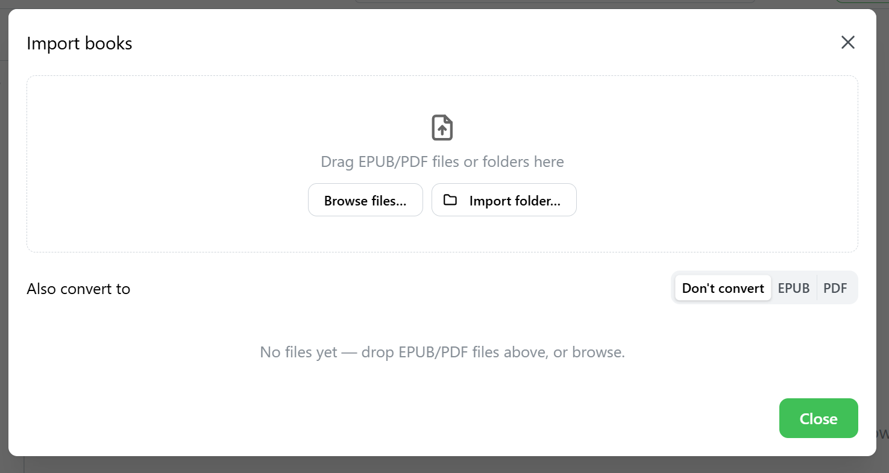
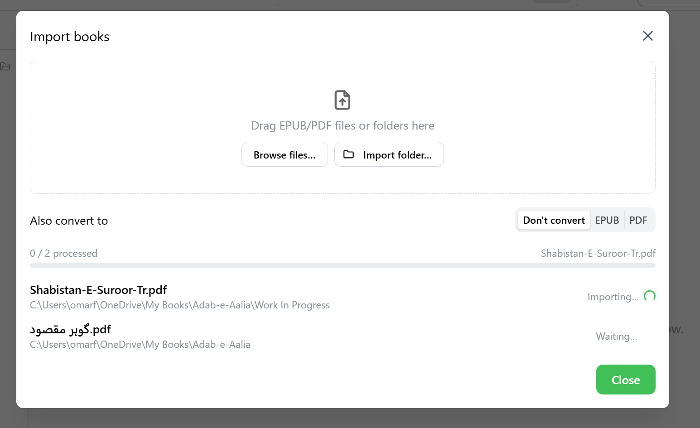
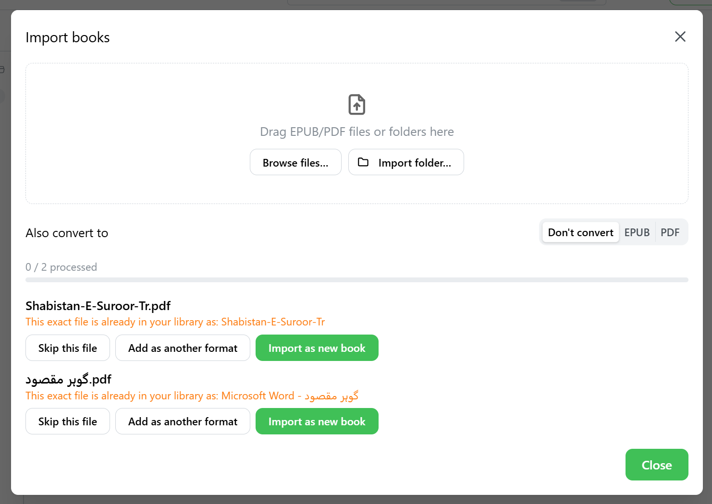

# Importing Books

There are two easy ways to add books to your Maktaba library: dragging files in, or using the
**Add Books** button. Maktaba supports **EPUB** and **PDF** files.

## Drag and drop

Simply drag one or more EPUB/PDF files (or a whole folder of them) from your computer's file
browser and drop them anywhere in the Maktaba window.

## Using the Add Books button

1. Click **Add Books** in the toolbar.
2. Choose the files (or a folder) you want to add.
3. Maktaba reads each book's title, author, cover, and other details automatically, and shows you
   a list before adding anything.

4. Review the list, then click **Import** to add them to your library.

If import can results in import of duplicate books, you are prompted to select the action to be taken. You can chose to do one of following actions:
- **Skip this file** : File will not be imported
- **Add as Another Format** : File will be added to existing book in library as a different format. e.g. if a pdf of a book already added to library, the new pub file being imported is added to the same book.
- **Import as New Book** : Import the book as a new book. If a book with title "Moby Dick" already exists, a new book with title "Moby Dick (2)" will be added 

## What happens to the files

Maktaba **copies** each book into your library folder, organized automatically into an
Author/Title structure — your original files, wherever they were, are left untouched.

## Importing a whole folder of books at once

If you point Maktaba at a folder (either by dragging it in, or picking it with **Add Books**),
it looks through every subfolder for ebook files too — handy if you're bringing books over from
another program or an old backup that already has its own folder structure.

> **Tip:** If a book's title, author, or cover looks wrong after importing, you can always fix it
> — see [Organizing Your Library](./organizing) and [Troubleshooting & FAQ](./troubleshooting).
