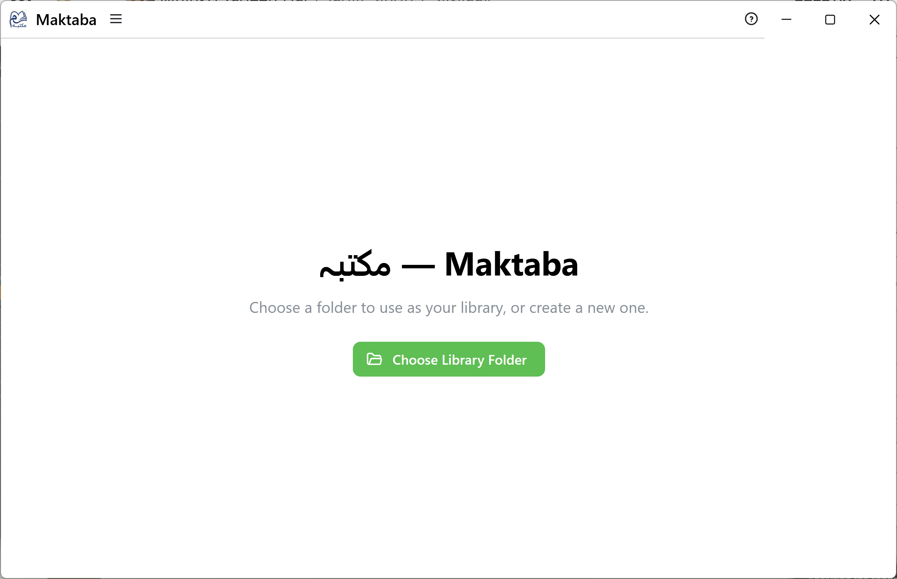
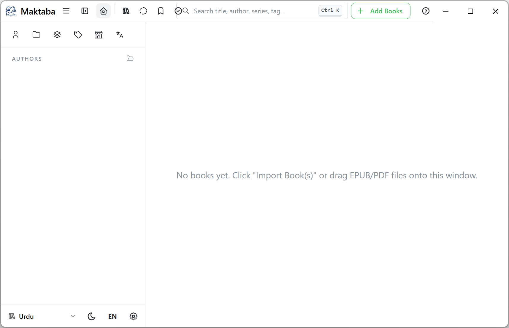
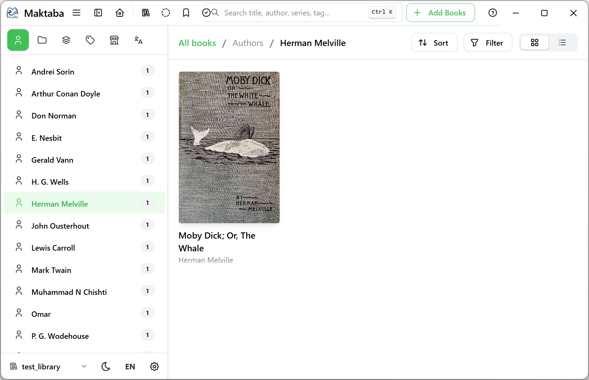

# Getting Started

Welcome to **Maktaba (مکتبہ)** — a simple way to keep all your ebooks organized on your own
computer, with a built-in reader, no accounts, and no internet connection required.

This guide walks you through everything you need for your first few minutes with Maktaba. If
you'd rather be guided step-by-step inside the app itself, open **Settings → Help** and click
**Replay Getting Started Tour** at any time.

## 1. Open Maktaba for the first time

The first time you open Maktaba, you'll see a simple welcome screen.

## 2. Choose where your books will live

Maktaba keeps your books in a **library** — a folder on your computer that you choose. This can
be an empty folder to start fresh, or an existing folder where you already keep ebook files.

1. Click **Choose Library Folder**.
2. Pick (or create) a folder — for example, a folder called "My Books" in your Documents.
3. Maktaba opens that folder as your library. If it already contains ebook files, Maktaba offers
   to add them for you right away.

> **Tip:** You don't need to organize files inside this folder yourself — once a book is added,
> Maktaba organizes the folder for you automatically.

## 3. Add your books

You can add books at any time by dragging EPUB or PDF files into the Maktaba window, or by using
the **Add Books** button. See [Importing Books](./importing) for the full walkthrough.

## 4. Browse and read

Once you've added a few books, your library fills the main window: covers, grouped by author,
with your Series, Tags, and Collections in the sidebar on the left. Click any book, then **Read**
to open it.

## 5. Where to go next

- [Choosing & Switching Libraries](./libraries) — if you'd like more than one library (for
  example, separate ones for different family members).
- [Organizing Your Library](./organizing) — authors, series, tags, and collections.
- [Reading Books](./reading) — using the built-in reader.
- [Settings & Preferences](./settings) — language, appearance, and more.

If anything doesn't work the way you expect, check [Troubleshooting & FAQ](./troubleshooting) —
or open **Settings → Help** inside the app any time you need this guide again.
