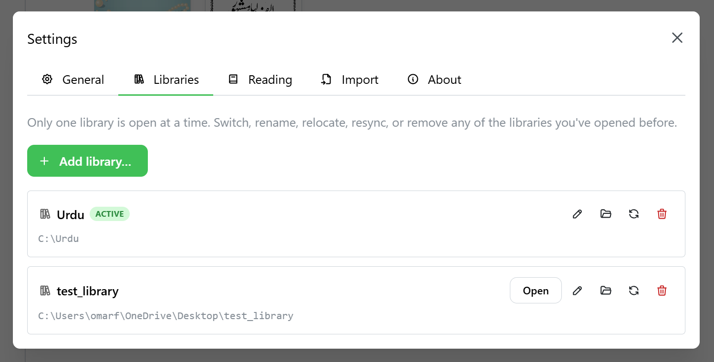
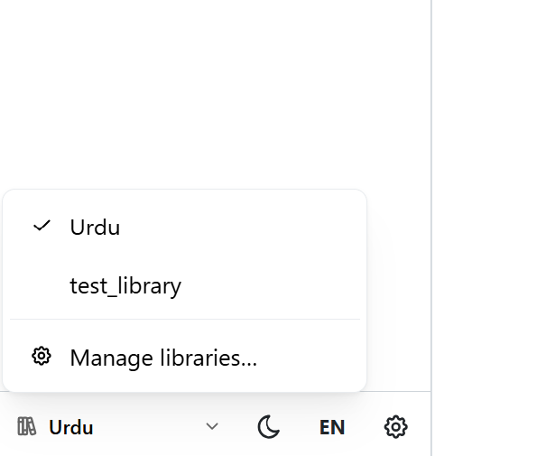

# لائبریری کا انتخاب اور تبدیلی

**لائبریری** محض آپ کے کمپیوٹر پر ایک فولڈر ہے جس میں مکتبہ آپ کی کتابیں رکھتا ہے۔ زیادہ تر
لوگوں کو صرف ایک ہی درکار ہوتی ہے، لیکن مکتبہ آپ کی چاہی گئی تعداد میں لائبریریوں کی حمایت کرتا
ہے — مثلاً الگ الگ مجموعے رکھنے کے لیے مفید، جیسے خاندان کے ہر فرد کے لیے ایک لائبریری، یا کسی
مشترکہ فولڈر کے لیے الگ لائبریری۔

## اپنی تمام لائبریریاں دیکھنا

**ترتیبات → لائبریریاں** کھولیں تاکہ وہ ہر لائبریری دیکھی جا سکے جو آپ نے پہلے کھولی ہے، جس میں
فی الوقت زیرِ استعمال لائبریری کو فعال کے طور پر نشان زد کیا گیا ہو۔

## ایک اور لائبریری شامل کرنا

**لائبریری شامل کریں** پر کلک کریں اور ایک فولڈر منتخب کریں، بالکل ویسے ہی جیسے آپ نے پہلی بار
مکتبہ کھولتے وقت کیا تھا۔ اس سے آپ کی موجودہ لائبریری پر کوئی اثر نہیں پڑتا — یہ صرف آپ کی فہرست
میں شامل ہو جاتی ہے۔

## لائبریریوں کے درمیان تبدیل ہونا

فہرست میں کسی بھی لائبریری کے ساتھ **تبدیل کریں** پر کلک کریں تاکہ اسے فعال بنایا جا سکے۔ مکتبہ
فوراً تبدیل ہو جاتا ہے — دوبارہ شروع کرنے کی ضرورت نہیں — اور آپ جو کچھ بھی دیکھتے ہیں (کتابوں کی
فہرست، سائیڈبار، اور تلاش) اب اسی لائبریری کی عکاسی کرتا ہے۔

آپ سیٹنگز ڈائیلاگ میں لائبریری کو فعال (active) کے طور پر تبدیل کرنے کے لیے صرف **کھولیں (Open)** بٹن پر کلک کر سکتے ہیں، یا سائیڈ بار کے نیچے موجود فوری رسائی (quick access) کا استعمال کر سکتے ہیں۔

## لائبریری کا نام بدلنا، منتقل کرنا، یا ہٹانا

اسی فہرست سے آپ یہ کر سکتے ہیں:

- **نام بدلیں** — یہ صرف وہ لیبل بدلتا ہے جو مکتبہ آپ کو دکھاتا ہے، فولڈر خود نہیں بدلتا۔
- **منتقل کریں** — مکتبہ کو بتائیں کہ فولڈر منتقل ہو گیا ہے (مثلاً نئی ڈرائیو پر) بغیر کچھ کھوئے۔
- **دوبارہ اسکین کریں** — مکتبہ کو فولڈر دوبارہ دیکھنے دیں، تاکہ ایپ کے باہر شامل یا تبدیل کی گئی
  کتابیں شامل ہو جائیں۔
- **ہٹا دیں** — کسی لائبریری کو فہرست سے ہٹا دیں — یہ صرف مکتبہ سے ہٹاتا ہے؛ آپ کی کتابیں اور فولڈر
  ڈسک پر کبھی حذف نہیں ہوتے۔

> **مشورہ:** مکتبہ کی فہرست سے لائبریری ہٹانا ہمیشہ آپ کی فائلوں کے لیے محفوظ ہے۔ کتابیں واقعی حذف
> کرنے کے لیے، انہیں مکتبہ کے اندر سے (یا خود فولڈر سے) حذف کریں — *لائبریری* ہٹانے سے صرف مکتبہ
> اس فولڈر کو ٹریک کرنا بند کر دیتا ہے۔
